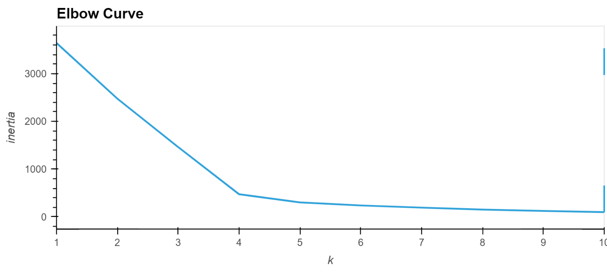

# Cryptocurrencies

## Objective

- Create a report on what cryptocurrencies are on the trading market and how they could be grouped to create a classification system.

### Tools

- Jupyter Notebook
- Python:
  - pandas
  - sklearn
  - hvplot

## Results

### Elbow Curve sugests that 4 clusters

### Clusters 3D 

### Clusters 2D 

